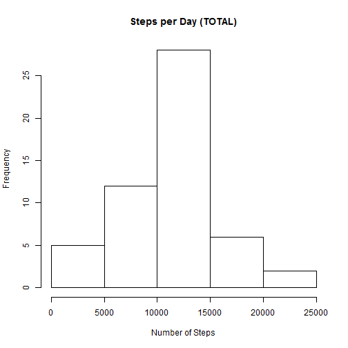
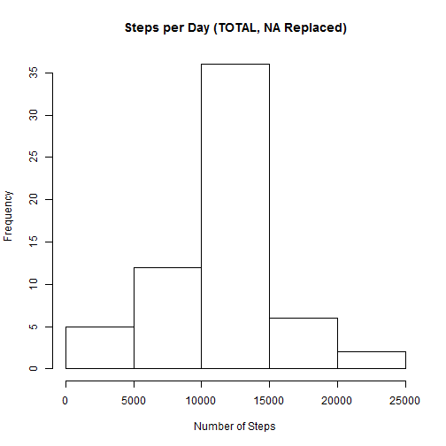
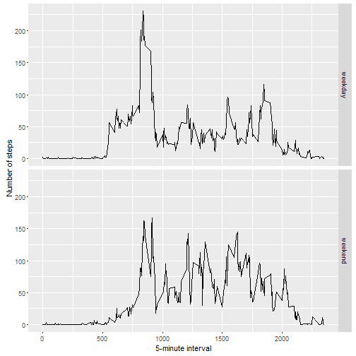

# Reproducible Research: Peer Assessment 1

## Loading and preprocessing the data

```r
#plotting libaray
library(ggplot2)
```

```
## Warning: package 'ggplot2' was built under R version 3.2.4
```

```r
#import data and modify data types
#setwd("GitHub/Coursera/Johns Hopkins/Reproducible Research/")
activity_data <- read.csv("activity.csv",header = TRUE)
activity_data_completecases <- activity_data[complete.cases(activity_data[,1]),]
activity_data_completecases$calc_steps <- as.numeric(activity_data_completecases$steps)
```

## What is mean total number of steps taken per day?

```r
# calculate sum, mean, and median steps per day
sum_stepsperday <- aggregate(activity_data_completecases$calc_steps, list(activity_data_completecases$date), sum)
mean_stepsperday <- aggregate(activity_data_completecases$calc_steps, list(activity_data_completecases$date), mean)
median_stepsperday <- aggregate(activity_data_completecases$calc_steps, list(activity_data_completecases$date), median)

#histogram of the total numbers of stepsper day
hist(sum_stepsperday$x,main = paste("Steps per Day (TOTAL)"), xlab="Number of Steps")
```



Mean steps per day (first 6 rows only): 

```
##      Group.1        x
## 1 2012-10-02  0.43750
## 2 2012-10-03 39.41667
## 3 2012-10-04 42.06944
## 4 2012-10-05 46.15972
## 5 2012-10-06 53.54167
## 6 2012-10-07 38.24653
```

Median steps per day (first 6 rows only): 

```
##      Group.1 x
## 1 2012-10-02 0
## 2 2012-10-03 0
## 3 2012-10-04 0
## 4 2012-10-05 0
## 5 2012-10-06 0
## 6 2012-10-07 0
```

## What is the average daily activity pattern?

```r
mean_stepsperinterval <- aggregate(activity_data_completecases$calc_steps, list(activity_data_completecases$interval), mean)
plot(mean_stepsperinterval$Group.1,mean_stepsperinterval$x, type="l", xlab="Interval", ylab="Number of Steps",main="Average Number of Steps per Day by Interval")
```


```r
max_interval <- mean_stepsperinterval[which.max(mean_stepsperinterval$x),1]
```
The 5-minute interval that contains the maximum number of steps is: 835
 
## Imputing missing values

```r
# get the number of missing values
num_missing <- nrow(activity_data) - nrow(activity_data_completecases)

# Replace each NA with the mean value of its 5-minute interval
fill.value <- function(steps, interval) {
  filled <- NA
  if (!is.na(steps))
    filled <- c(steps)
  else
    filled <- (mean_stepsperinterval[mean_stepsperinterval$Group.1==interval, "x"])
  return(filled)
}
filled.data <- activity_data
filled.data$steps <- mapply(fill.value, filled.data$steps, filled.data$interval)

# re-calculate sum, mean, and median steps per day
sum_stepsperday_new <- aggregate(filled.data$steps, list(filled.data$date), sum)
mean_stepsperday_new <- aggregate(filled.data$steps, list(filled.data$date), mean)
median_stepsperday_new <- aggregate(filled.data$steps, list(filled.data$date), median)

hist(sum_stepsperday_new$x,main = paste("Steps per Day (TOTAL, NA Replaced)"), xlab="Number of Steps")
```



## Are there differences in activity patterns between weekdays and weekends?

```r
#set up data frame

filled.data$calc_date <- as.POSIXct(filled.data$date, format="%Y-%m-%d")

# Compute the weekdays from the date attribute
filled.data$weekday <-  tolower(weekdays(filled.data$calc_date))

# Compute the day type (weekend or weekday)
filled.data <- cbind(filled.data, 
                      daytype=ifelse(filled.data$weekday == "saturday" | 
                                       filled.data$weekday == "sunday", "weekend", 
                                     "weekday"))

averages <- aggregate(steps ~ interval + daytype, data=filled.data, mean)
ggplot(averages, aes(interval, steps)) + geom_line() + facet_grid(daytype ~ .) +
  xlab("5-minute interval") + ylab("Number of steps")
```


